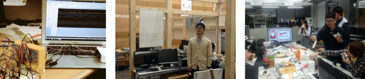

# ミーティング
2021年度秋学期

初回,第２回: 木曜日18:30-

以降: 木曜日18:30- 

当面の間はオンラインとオフライン(Δ N111-112)のハイブリットにて行なっています。

# ファカルティ
松谷 健史 (macchan)

# メンバー
M2: fumi

B4: cyan

B3: sui, mkei

B2: daiya, ras

# 新人募集中
新人は随時受け付けています。聴講やミーティングへの飛び入り参加も歓迎です！

ご質問やミーティングの参加リンクについては、 <arch@sfc.wide.ad.jp> までメールをください。

# Contact Us
お問い合わせは <arch@sfc.wide.ad.jp> まで。

研究室：デルタ館 (研究棟) 北側2階学部生部屋 (ΔN204~207)

# About Us
インターネットに関する数多くのプロトコルや規格が提案・標準化されてきた。

これらの技術を集結することにより、インターネットはユーザの多様なニーズに対応してきた。

現在、次世代インターネットの基盤技術として、大容量データ伝送を実現するラムダネットワークや、
携帯電話やPDA等の移動体がインターネットへの接続性を常時確保するためのプロトコルに注目が集まっている。

今後、これらの技術が利用されることで、インターネットは多様な技術が集結することでより複雑化することが予想される。

こうしたネットワークを構築・運用していくためには個々の技術に関する知識だけでなく、複雑化したネットワークをシンプルに捉える能力が必要となる。

Arch はインターネットアーキテクチャの理解を深めると共に、次世代のインターネットアーキテクチャの提案・構築・運用を行う。

# Keywords
Archにおける現在の研究トピックを以下に示す。

- FPGA
- Programming Language
- OS
- Audio
- Mobility
- Overlay Network
- Internet Communication
- Low-Latency IP Video Transmission
- Drone

上記のようにInternet Architecture KGは研究テーマを限定しない。
インターネット技術で興味のある分野を研究するための環境がある。

Archの特徴は各技術に特化するだけでなく、アーキテクチャ的視点から各技術を捉えることである。

# News

- 2022/05/23: 水野史暁 (fumi) がIEICEコミュニケーションクオリティ研究会において学生優秀発表賞を受賞しました
- 2021/06/01: 水野史暁 (fumi) が2021年度未踏IT人材発掘・育成事業に採択
- 2021/05/31: 水野史暁 (fumi) が森泰吉郎記念研究振興基金に採択されました
- 2021/05/28: 上田侑真 (cyan) が2020年度未踏IT人材発掘・育成事業においてスーパークリエータに認定されました
- 2020/06/09: 上田侑真 (cyan) が2020年度未踏IT人材発掘・育成事業に採択されました

